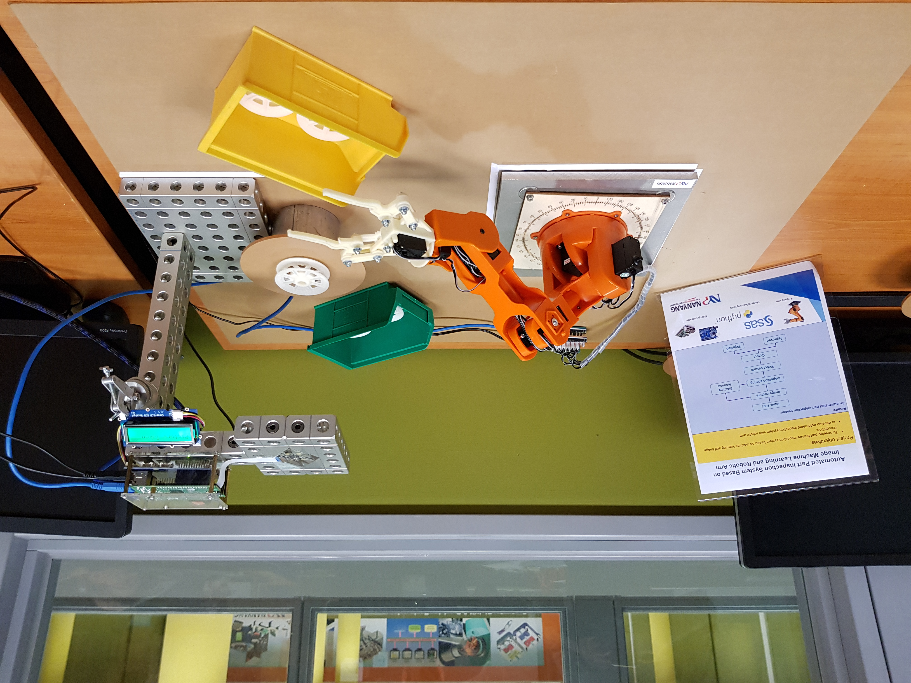
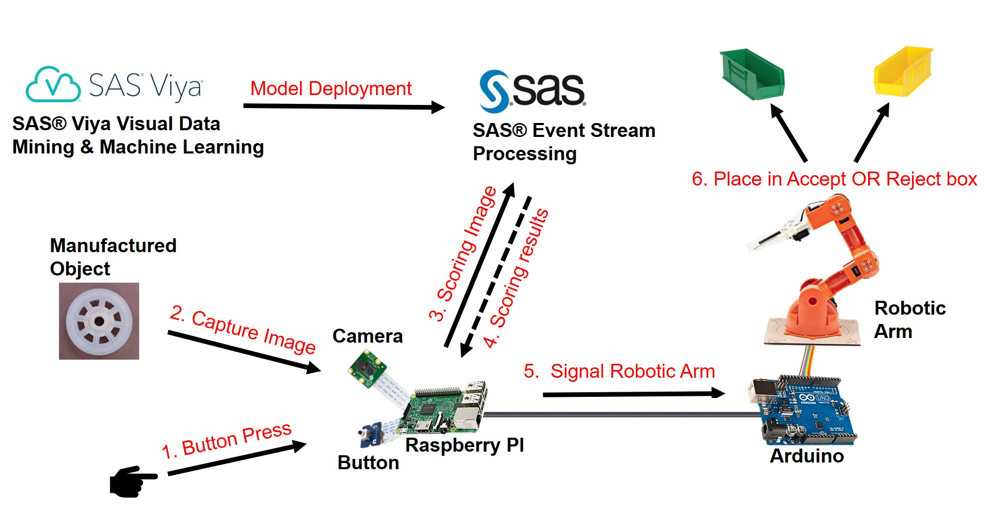

# Introduction

The purpose of this demo is to showcase the capabilities of ESP with Edge Analytics, enabling users to deploy analytical models on the edge and sending back only the important data. 

This demo integrates multiple IoT devices, show casing a fully integrated mock up system of a manufacturing quality control use case. In this mock up, IoT devices such as a Robot Arm controlled by an Arduino Board and a Raspberry PI are integrated.

The Raspberry PI acts as a controller, initiating the capture of an image for the manufactured item, then communicating with ESP via Web Socket for it to score the image and finally initiates the connected Arduino to perform certain action sets.

# Demo

[Demo Link](https://cloud.potatovault.com/s/sas-robot-arm-demo)

# Requirements/Dependencies

This project assumes that you have the following hardware and software:

## Hardware:

1. A Raspberry Pi with:
-	1x Pi Camera
-	1x Grove LCD
-	1x Grove Button

2. An Arduino with:
-	1x Braccio Robotic Arm
-	1x Arduino Cable
	 
## Software:

1. Arduino IDE (On Raspberry pi)

2. Python 2.7 with the following packages installed (On Raspberry pi):
-	Serial (pip install serial)
-	websocket-client (pip install websocket-client)
-	[opencv2](https://tutorials-raspberrypi.com/installing-opencv-on-the-raspberry-pi/)
-	picamera (pip install picamera)
-	grovepi (pip install grovepi)

3. SAS ESP 5.1  

